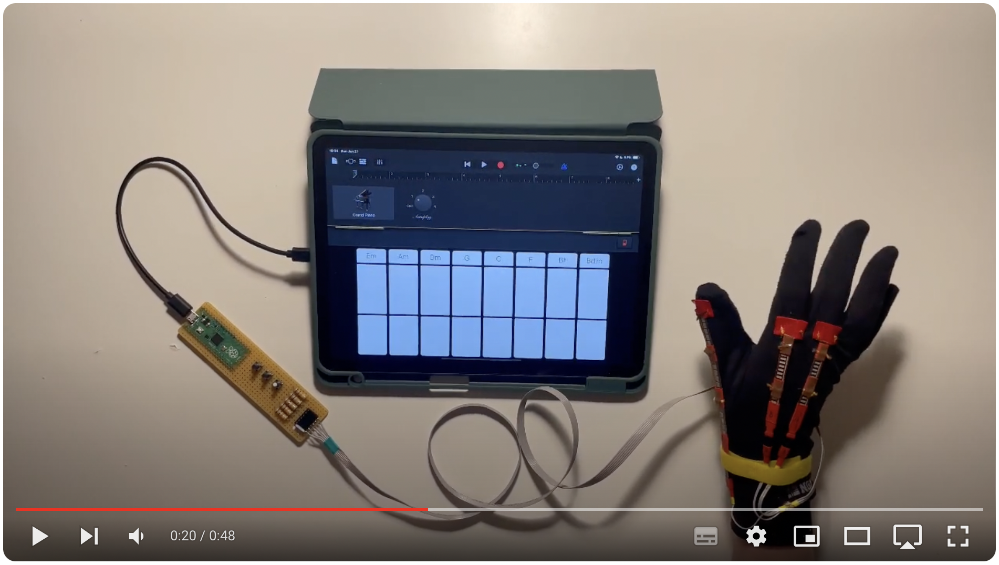

# MIDIGlove

Raspberry Pico based midi glove. Project made with CirquitPython for Academy of Art (Novi Sad). The glove is midi-keyboard (three keys on three fingers) to play on MacBook or iPad Air 5.

## Parts list

1. [Installing CircuitPython](https://learn.adafruit.com/getting-started-with-raspberry-pi-pico-circuitpython/circuitpython) - a manual from Adafruit
2. [Flex sensor](https://coolcomponents.co.uk/products/flex-sensor-2-2?_pos=3&_sid=17f570541&_ss=r) - two kind in my project: long and short
3. Literally any glove
4. Raspberry Pico

## Documentation needed

1. [Adafruit MIDI Library](https://docs.circuitpython.org/projects/midi/en/latest/api.html#adafruit-midi-note-on)

## Video of using (click on preview)

## Practical notes

The idea is simple: flex sensor changes own resistans on deformation. Lets read the values in voltage divider and understand that the finger changes its state (like pressing the key). As far as every finger is independant from others I decide to build this with object-oriented code. Here are three buttons: (nothing, reset state, reboot device).

Why I need "reset state" buttons: our hand chenges fingers poses eventually this button defines "zero state" or relaxed finger position. Use it after you wear it on or chenges the position (hand in air after a table and so on).

"Reboot device"? Yep, this will "de-attach & attach" device.

